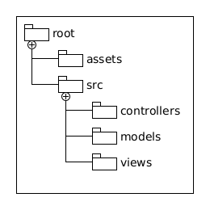

### Design project structure

**Created a project structure following best practices for a Tkinter game interface.**

* **assets/**: Stores all static files like images, icons, and audio.
* **src/**: Contains the application source code.
  * **controllers/**: Handles the business logic and user input.
  * **models/**: Manages the data and game state.
  * **views/**: Renders the Tkinter user interface elements.
